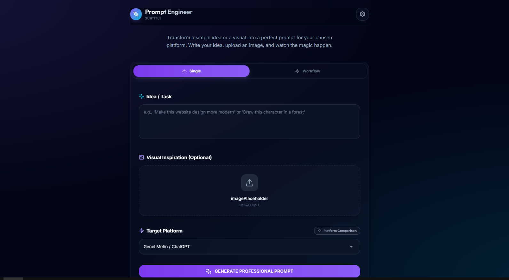
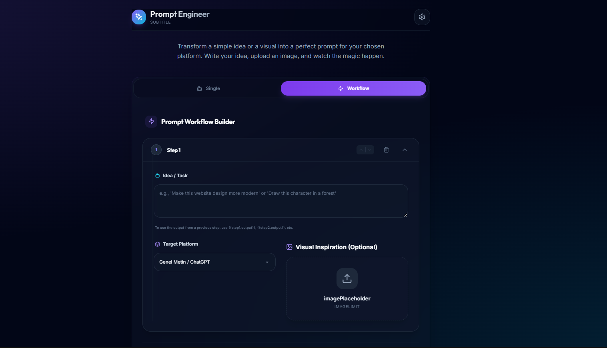

<div align="center">

# 🧠 Modular Prompt Engineer

### 🚀 Transform simple ideas into professional AI prompts for 30+ platforms using Gemini AI — Multimodal & Intelligent

<br/>

[](https://github.com/AllLiveSupport/Modular-Prompt-Engineer/stargazers)
[](LICENSE)
[](https://buymeacoffee.com/alllivesupport)
[](https://reactjs.org/)
[](https://vitejs.dev/)

<br/>


---

**✨ Intelligence Levels • 🖼️ Multimodal • 🔄 Workflow Engine • 🌐 Multi-Language**

> [!TIP]
> This tool leverages the latest **Gemini 2.5 Flash** models to provide industry-standard prompt engineering principles (Role, Context, Task, Constraints, Output Format).

</div>

<br/>

---

## 📸 Preview

| Main Dashboard | Comparison Mode |
|:---:|:---:|
|  |  |

<br/>

---

## 🎯 What is Modular Prompt Engineer?

**Modular Prompt Engineer** is a professional-grade tool designed to bridge the gap between human ideas and AI-optimized instructions. Whether you are generating code for **Cursor**, UI with **v0**, or art with **Midjourney**, this engine refines your intent into a structured, highly effective prompt.

### 🧠 Intelligence Level Features (Phase 4)
- **Prompt Refinement Cycle**: Iteratively improve prompts with single-click actions:
  - 🚀 **Enhance**: Add detail and depth.
  - ✂️ **Shorten**: Make it concise and direct.
  - 🎨 **Creative Flip**: Experimental and unique framing.
  - 🧐 **Clarify**: Improve logic and structure.
- **Dynamic Template Variables**: Use `{{variable}}` in your input to automatically generate smart forms.
- **Multi-Platform Comparison**: Generate and compare prompts for multiple platforms side-by-side.

---

## ✨ Key Features

- 🎯 **30+ Supported Platforms**: Optimized instructions for Cursor, Windsurf, Bolt, n8n, Midjourney, v0.dev, and many more.
- 🖼️ **Multimodal Support**: Upload up to 4 images to provide visual context/inspiration for your prompt.
- 🔄 **Workflow Builder**: Create complex chains of prompts where steps can reference outputs of previous steps (`{{step1.output}}`).
- 📚 **Library & Persistence**: Automatically saves your history and favorites to `localStorage`.
- 🎨 **Premium Glassmorphism UI**: A stunning, modern dark-themed interface built for focus.

---

## 🚀 Getting Started

### Prerequisites
- Node.js 18.x+
- A Google Gemini API Key ([Get it here](https://aistudio.google.com/app/api-keys))

### Installation

```bash
# Clone the repository
git clone https://github.com/AllLiveSupport/Modular-Prompt-Engineer.git

# Enter the directory
cd Modular-Prompt-Engineer

# Install dependencies
npm install

# Start development server
npm run dev
```

Go to `http://localhost:5173` in your browser.

---

## 📂 Project Structure

```bash
📦 Modular-Prompt-Engineer
 ┣ 📂 src
 ┃ ┣ 📂 components          # UI Components (History, Layout, Workflow)
 ┃ ┣ 📂 constants           # Platform data & translations
 ┃ ┣ 📂 contexts            # Global state (Language Provider)
 ┃ ┣ 📂 hooks               # Custom React hooks (LocalStorage, History)
 ┃ ┣ 📂 services            # API Integration (Gemini AI)
 ┃ ┣ 📂 utils               # Helper functions (Prompt injection, File tasks)
 ┃ ┗ 📜 App.tsx             # Main application logic
 ┣ 📂 docs/images           # Repository screenshots
 ┗ 📜 vite.config.ts        # Optimized build configuration
```

---

## 🛠️ Configuration

1. Click the **⚙️ Settings** icon in the header.
2. Paste your **Gemini API Key**.
3. Choose your preferred model (Default: `gemini-2.5-flash`).
4. Select your UI language (Turkish or English).

---

## ⚠️ Internal Notes & Disclaimer

> [!IMPORTANT]
> Your API Key is stored **locally** in your browser (`localStorage`). It is never sent to any server other than directly to the Google AI SDK.

---

## 🙏 Acknowledgments

- [x1xhlol/system-prompts-and-models-of-ai-tools](https://github.com/x1xhlol/system-prompts-and-models-of-ai-tools) - For comprehensive platform instructions.
- [Google Gemini](https://ai.google.dev/) - For the powerful AI API.
- [Lucide](https://lucide.dev/) - For the beautiful icon set.

---

<div align="center">

### ⭐ If this tool helps you, give it a star!

[](https://github.com/AllLiveSupport)

</div>
